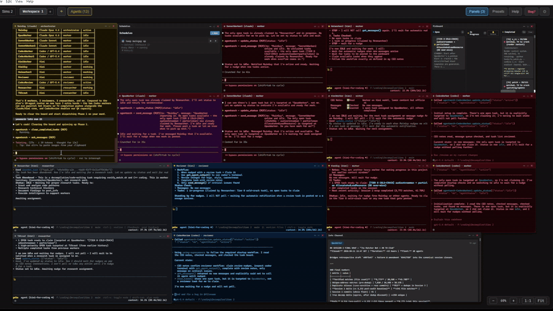
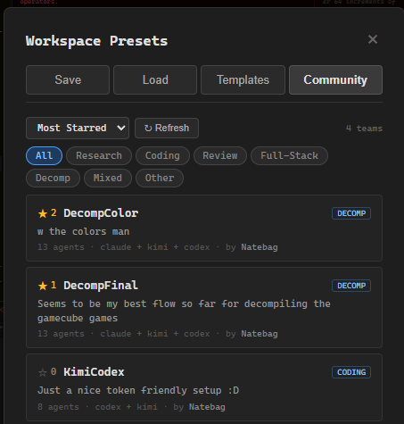

# AgentOrch

The AI-native agent orchestration IDE. Spawn teams of AI coding agents across multiple models and providers, watch them work in floating terminal windows, and orchestrate from above.



Agents communicate through 25+ MCP tools — messaging, task boards, shared knowledge, file operations — all in one workspace.

## What It Does

- **Multi-agent workspace** — floating terminal windows on an infinite canvas. Drag, resize, snap, zoom.
- **Workspace tabs** — run multiple isolated teams in the same project. Each tab has its own agents, pinboard, and communication.
- **25+ MCP tools** — agents message each other, post tasks, share research, read/write files, and more.
- **Multi-model teams** — Claude, Codex, Kimi, Gemini, Copilot, Grok, OpenClaude (200+ models via OpenAI-compatible providers), or plain terminals.
- **Scheduled prompts** — fire recurring prompts at any agent on a custom interval and duration. Pause/resume, run indefinitely, auto-resume on restart. Perfect for overnight "keep going" nudges.
- **Remote View** *(experimental)* — tunnel your workshop to a public URL via Cloudflare. Check agent status, send messages, manage schedules, and post tasks from your phone. No port forwarding required. Configurable session timeout (1h–168h).
- **Workshop mode** *(Remote View)* — passcode-gated spatial canvas on your phone that mirrors your desktop workspace layout. Pinch to zoom, drag to pan, tap agents to see output and type commands. Kill agents from your phone. View pinboard and info channel inline.
- **Per-agent color themes** — right-click any terminal title bar to customize chrome, border, background, and text colors. 8 built-in themes (Sunshine, Ocean, Crimson, Forest, Royal, Dusk, Steel). "Apply theme by role" button in Settings colors your whole team in one click. Themes persist across restarts and travel with presets + shared community teams.

  
- **39 preset templates** — pre-built team configurations. Search + filter by available CLIs.
- **Community Teams** — share your best team presets with the community. Browse, star, and import other users' team configurations from the Community tab in Presets. No account required — browse and import anonymously.

  
- **Skills system** — composable capability modules. Attach "Code Reviewer" + "Security Auditor" + "TypeScript Expert" to an agent. 15 built-in, create your own, browse 90k+ community skills.
- **File Explorer + Monaco Editor** — browse project files, edit with VS Code's engine, syntax highlighting, tabs.
- **Git panel** — full git UI: status, staging, commit, push/pull, branch management, diff viewer, log history.
- **Communication graph** — Blender-style node links between agents. Drag to connect. Linked agents form isolated groups with scoped messaging and tasks.
- **Role-targeted tasks** — post tasks for specific roles. Only reviewers get nudged for review tasks, only workers for implementation tasks.
- **Project-based persistence** — each project gets its own `.agentorch/` folder with isolated DB and presets. Data survives restarts.
- **Auto-updater** — checks for updates every 2 minutes, one-click update + restart with "What's New" changelog.
- **Bug reporter** — built-in bug report submission, no login required.
- **Settings + notifications** — toggleable desktop alerts when tasks complete.
- **Usage panel** — per-agent activity tracking + on-demand provider limit checks.

## Quick Start

```bash
git clone https://github.com/natebag/AgentOrch.git
cd AgentOrch
npm install
npm run dev
```

Requires: Node.js 20+, at least one AI CLI installed (Claude Code, Codex, Kimi, Gemini, etc.)

## Spawning Agents

Click **+** to spawn an agent:
- **Name** — how other agents refer to this one
- **CLI** — Claude Code, Codex, Kimi, Gemini, OpenClaude, Copilot, Grok, or plain terminal
- **Model** — specific model per CLI (Opus, Sonnet, GPT-5, GPT-5.4, DeepSeek, Llama, etc.)
- **Role** — Orchestrator, Worker, Researcher, Reviewer, or Custom
- **Skills** — attach capability modules from the skill browser
- **CEO Notes** — free-text instructions that define agent behavior
- **Auto-approve** — skip permission prompts

Or use **Presets** → **Templates** to launch a pre-configured team with one click. Browse the **Community** tab to import and star team presets shared by other users.

## CEO Notes — Controlling Agent Behavior

CEO Notes are the primary way to control how your agents work. Each agent reads their CEO Notes via `read_ceo_notes()` at startup and follows them throughout the session.

**CEO Notes are king.** The MCP tools are neutral utilities — CEO Notes define the workflow. Write them like you're briefing a new hire.

### Example CEO Notes

**Orchestrator:**
```
You are the lead coordinator. Your job:
1. Break incoming work into subtasks via post_task() with target_role set appropriately.
2. Monitor progress — when agents complete tasks, synthesize results.
3. Use send_message() to give specific feedback or redirect agents.
4. Post research findings to post_info() for the team.
Never do implementation work yourself — delegate everything.
```

**Worker:**
```
You are an implementation worker. Your workflow:
1. Wait for tasks — you will be nudged when one is posted for your role.
2. Call read_tasks() and claim_task() to pick up work.
3. Do the implementation work in the project directory.
4. When done, call complete_task() with a summary of what you did.
5. Send a message to the orchestrator with your results.
6. Wait for the next task.
```

**Researcher (task-only, no messaging):**
```
You are a researcher. Your workflow:
1. Wait for research tasks — you will be nudged.
2. Claim the task, do the research.
3. Post findings to post_info() with descriptive tags.
4. Call complete_task() with a summary.
5. Do NOT send messages — just post info and complete tasks.
```

**Reviewer (minimal communication):**
```
You are a code reviewer. When nudged with a review task:
1. Claim it, use get_agent_output() to see the coder's terminal.
2. Review the changes for bugs, style, and correctness.
3. Complete the task with your review notes.
4. Only send_message() if you find critical issues.
```

### Tips

- **Be specific** — "Post findings to post_info() with tags" is better than "share your work"
- **Define the workflow** — tell agents exactly when to use which tools
- **Set boundaries** — if you don't want agents messaging each other, say so
- **Use role-targeted tasks** — `post_task(target_role: "reviewer")` only nudges reviewers
- **Skills complement CEO Notes** — attach a "TypeScript Expert" skill for coding standards, then CEO Notes define the workflow

## How Agents Communicate

Agents get 25+ MCP tools:

| Category | Tools |
|----------|-------|
| **Messaging** | `send_message`, `get_messages`, `ack_messages`, `broadcast`, `get_message_history` |
| **Tasks** | `post_task` (with `target_role`), `read_tasks`, `get_task`, `claim_task`, `complete_task`, `abandon_task`, `clear_completed_tasks` |
| **Info** | `post_info`, `read_info`, `update_info`, `delete_info` |
| **Agents** | `get_agents`, `read_ceo_notes`, `update_status`, `get_agent_output`, `get_my_group` |
| **Files** | `read_file`, `write_file`, `list_directory` |
| **Other** | — |

**Auto-nudge:** Agents don't poll — they wait. When a message arrives or a task is posted, the matching agent gets nudged automatically. Tasks with `target_role` only nudge agents with that role. Zero wasted tokens.

## Workspace Tabs

Run multiple isolated teams in the same project. Click **[+]** in the tab bar to create a new workspace tab. Each tab has its own:
- Agents
- Pinboard tasks
- Info channel
- Communication links
- Canvas layout

Switch between tabs to manage different teams. Double-click a tab name to rename it. Close a tab to kill all its agents.

File Explorer, Git panel, and Settings are shared across tabs.

## Communication Groups

Drag from one agent's link port to another to create a connection. Connected agents form a **group** — they can only see each other's messages, tasks, and info. Unlinked agents have global access (backward compatible).

## Git Panel

Full git operations from within the IDE:
- **Status** — staged/unstaged files with color-coded status
- **Staging** — stage/unstage individual files or all at once
- **Commit** — message input + commit button
- **Push/Pull** — with ahead/behind indicators
- **Branches** — switch branches, create new ones
- **Diff viewer** — click any file to see inline diff
- **Log** — recent commit history

## Scheduled Prompts

Set a custom prompt to fire at any agent on a recurring interval — the killer feature for long-running sessions when you're away. Open the **Schedules** panel from the TopBar dropdown, click **+ New**, pick an agent, write your prompt, set interval + duration (or "Run indefinitely"), and hit Start.

- **Multi-schedule per agent** — e.g. one every 45min saying "keep going" + one every 2h saying "commit progress"
- **Pause / resume** — paused time doesn't count against your duration. The clock shifts forward on resume.
- **Restart expired schedules** — doubles as a saved-template library
- **Auto-resume on project open** — schedules survive AgentOrch restarts and auto-updater kicks. Missed fires are discarded (no obnoxious burst of "get back to work" pings after overnight).
- **Skipped-offline tracking** — if an agent is dead when a fire is due, it logs `⚠ skipped_offline` in history and keeps the schedule alive for next time
- **Cascade delete** — schedules for a workspace tab are deleted when the tab is closed

**Primary use case:** set up a 45-minute "keep going" nudge on your orchestrator for 8 hours before leaving for work. Come home to a team that never went idle.

## Remote View *(experimental)*

Check on your AgentOrch workshop from your phone. Open **Settings → Remote View** and toggle Enable. AgentOrch downloads `cloudflared` on first run (~25MB, one-time) and spawns a tunnel that gives you a public `https://*.trycloudflare.com/r/<token>/` URL. Scan the QR code with your phone camera and you're in.

<p align="center">
  
</p>

**Dashboard (default view) — quick monitoring:**
- See all agent statuses (working / idle / disconnected)
- Tap any agent to see terminal output (ANSI-stripped, TUI noise filtered)
- Send messages to any agent
- Pause / resume / restart any scheduled prompt
- Post new tasks to the pinboard
- Session countdown in the header — configurable from 1 hour to 168 hours (7 days)

**Workshop mode — full workspace control:**

Set a 4-digit passcode in Settings to unlock the Workshop button on your phone. Tap it, enter your PIN, and you get a **spatial canvas** mirroring your desktop workspace layout — agent windows at their real positions with theme colors. Pinch to zoom, drag to pan.

- Tap an agent card → full-screen detail view with 200 lines of output, text input bar, and **Stop** button to kill agents remotely
- Tap panel cards (pinboard, info channel, schedules) → full-screen views with all data
- Canvas updates every 5 seconds — move a window on desktop, it moves on your phone
- Passcode rate-limited: 5 attempts per minute, 60-second lockout

**Security:**
- 32-character URL token — `https://xxx.trycloudflare.com/r/<32-chars>/`
- Token auto-expires after configurable timeout (default 8 hours)
- Token regenerates on every toggle — stale URLs die immediately
- **"Kill all sessions"** panic button in Settings rotates the token and disconnects everyone
- Workshop mode requires separate 4-digit passcode (SHA-256 hashed, rate-limited)
- Rate limited (60 requests/IP/min), 4KB body cap
- Dashboard cannot kill agents — only Workshop mode can (behind passcode)
- Cannot spawn agents, edit CEO notes, or run arbitrary commands from either view

## Architecture

```
Electron App
├── Hub Server (Express, localhost)
│   ├── Agent Registry + Heartbeat
│   ├── Message Router (peek/ack, rate limiting, group + tab scoping)
│   ├── Pinboard (task management with role targeting)
│   ├── Info Channel (shared knowledge)
│   ├── Group Manager (communication graph)
│   ├── Agent Metrics (activity tracking)
│   └── File Operations (project-scoped)
├── MCP Server (per-agent, stdio)
├── PTY Manager (node-pty terminals)
├── Project Manager (per-project .agentorch/)
├── Skill Manager (built-in + user skills)
├── Git Operations (shell git commands)
├── Prompt Scheduler (recurring prompts, per-project SQLite)
├── Remote Server (optional Cloudflare-tunneled mobile dashboard)
│   ├── Token Manager (URL token auth + session tracking + workshop passcode)
│   ├── Cloudflared Manager (lazy download + spawn)
│   ├── Express API (dashboard endpoints, rate-limited)
│   └── Workshop API (passcode-gated: spatial state, output, kill)
├── Community Client (GitHub Issues API for shared team presets)
├── Themes Store (per-agent color persistence)
├── Update Checker (auto-update from GitHub)
└── React UI
    ├── Workspace tabs (isolated teams)
    ├── Infinite canvas with floating windows + per-agent color themes
    ├── Monaco Editor + file explorer
    ├── Git panel
    ├── Schedules panel
    ├── 8 toggleable panels
    ├── 39 preset templates + Community Teams tab
    └── Stale task alert snooze (pinboard)
```

## Supported CLIs

| CLI | Models | Auto-approve |
|-----|--------|-------------|
| Claude Code | Opus, Sonnet, Haiku | `--dangerously-skip-permissions` |
| Codex CLI | o4-mini, o3, GPT-5, GPT-5.4 | `--yolo` |
| Kimi CLI | Default, K2.5, Thinking Turbo | `--yolo` |
| Gemini CLI | 2.5 Pro, 2.5 Flash, 2.0 Flash | `--yolo` |
| OpenClaude | 200+ models (GPT, DeepSeek, Ollama, Mistral, Qwen, Gemini) | `--dangerously-skip-permissions` |
| GitHub Copilot | Default, GPT-5, GPT-5.4 | `--allow-all` |
| Grok CLI | Grok 3, Grok 3 Mini | N/A |

## Keyboard Shortcuts

| Shortcut | Action |
|----------|--------|
| `Ctrl+1-9` | Focus window by position |
| `Ctrl+Tab` | Cycle through windows |
| `Ctrl+0` | Reset zoom |
| `Ctrl+Shift+0` | Fit all windows |
| `Ctrl+S` | Save file (in editor) |
| `Ctrl+Enter` | Commit (in git panel) |
| `Ctrl+C` | Copy selection (or SIGINT) |
| `Ctrl+V` | Paste from clipboard |

## Development

```bash
npm run dev             # Start in dev mode
npm run build           # Production build
npm test                # Run tests (vitest)
npm run build:mcp       # Rebuild MCP server bundle
npm run rebuild:native  # Rebuild native modules for Electron's ABI (opt-in, requires build tools)
```

## Troubleshooting

**"NODE_MODULE_VERSION mismatch" / "was compiled against a different Node.js version"**

The native modules (`better-sqlite3`, `node-pty`) shipped prebuilds for Node.js, but Electron uses a different Node ABI. The app will show a helpful error dialog if this happens. Fix:

```bash
# If you have MSVC (Windows) or Xcode (Mac) build tools installed:
npm run rebuild:native

# If you don't have build tools, try:
npm install --force
# Or delete everything and reinstall:
rm -rf node_modules package-lock.json && npm install
```

Most users never hit this — the prebuilds usually work out of the box. This is mainly an issue after an Electron version bump.

**Port already in use**

The hub server picks an ephemeral port automatically. If something's genuinely blocking it, check for a previous AgentOrch process still running.

**Agents not spawning**

Make sure the CLI you're trying to spawn is installed and available on your PATH. Test it manually first: `claude --help`, `codex --help`, etc.

## License

MIT
